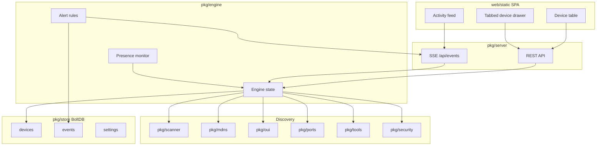

# Gofing Roadmap

Turn Gofing into a full-featured, Fing-like **macOS network and device diagnostic tool**: discover devices, fingerprint them, monitor presence, run lightweight security checks, and expose network tools — all through a local web UI.

This document is written for an AI coding agent. Each task is a self-contained work order. Implement **one task at a time**, verify acceptance criteria, then move on.

---

## How to use this roadmap (for agents)

1. Pick the **lowest-numbered unchecked task** whose dependencies are done.
2. Read the task fully before editing. Touch only the listed files unless a dependency forces a small follow-on change.
3. Follow [Cross-cutting conventions](#cross-cutting-conventions).
4. After the task:
   ```bash
   go test ./...
   go build -o gofing .
   ```
5. Check the task box (`- [ ]` → `- [x]`) in this file when acceptance criteria pass.
6. Prefer one logical commit (or PR) per task. Do not skip ahead to later phases.

**Do not** introduce Windows/Linux abstractions, CVE databases, credentialed vulnerability scanners, or CGO dependencies.

---

## Vision

Gofing runs as a single Go binary on macOS. It:

- Scans the local subnet and maintains a persistent device inventory
- Identifies devices by MAC (with private-MAC reconciliation), OUI vendor, mDNS, and services
- Monitors online/offline presence and emits alerts
- Offers per-device tools (port scan, WOL, ping, traceroute)
- Runs lightweight security heuristics
- Serves an embedded SPA with live SSE updates

---

## Scope decisions (locked)

| Decision | Choice |
|---|---|
| Platform | **macOS only** — shell out to `arp`, `ping`, `dns-sd`, `traceroute`, `osascript`, etc. |
| Storage | **BoltDB** (`go.etcd.io/bbolt`) via `pkg/store` — pure Go, no CGO |
| Ambition | **Full Fing parity** within the phase list below |
| Security depth | **Lightweight heuristics only** (Phase 5) — no CVE/NSE/credentialed scans |

---

## Current state (baseline)

| Package / area | What exists today |
|---|---|
| [`main.go`](main.go) | Flags (`-port`, `-interval`, `-open`), initial scan, background ticker, HTTP server |
| [`pkg/engine`](pkg/engine) | In-memory `map[string]*Device` keyed by **IP**; SSE event emit |
| [`pkg/scanner`](pkg/scanner) | Ping sweep + `arp -an` → `RawDevice` |
| [`pkg/mdns`](pkg/mdns) | `dns-sd` browse + hostname/type fingerprinting |
| [`pkg/oui`](pkg/oui) | Embedded Nmap OUI + `mac_cache.json` disk cache |
| [`pkg/ports`](pkg/ports) | `ScanPorts` + `CommonPorts` — **not wired into engine/API** |
| [`pkg/network`](pkg/network) | Active iface, gateway, SSID, computer name |
| [`pkg/server`](pkg/server) | `/api/network`, `/api/devices`, `/api/scan`, `/api/events` (SSE) |
| [`web/static`](web/static) | SPA table + **modal** device detail (no tabs, no persistence UI) |

**Gaps vs Fing:** no persistence/history, IP-keyed identity, no presence monitor/alerts, unused port scan, no WOL/ping/traceroute/speed test, no security score, no export, no launchd install.

---

## Target architecture



---

## Cross-cutting conventions

1. **OS calls:** Always `exec.CommandContext` with a hard timeout (mirror [`pkg/scanner`](pkg/scanner/scanner.go) / [`pkg/mdns`](pkg/mdns/mdns.go)).
2. **State:** Engine is the single source of truth. Persist every mutation through `pkg/store`. Emit an SSE event for every user-visible change.
3. **HTTP:** JSON via existing `writeJSON` in [`pkg/server/server.go`](pkg/server/server.go). Streaming tools reuse the SSE broadcast pattern (or a dedicated SSE stream per action if needed).
4. **Device ID:** Stable string. Prefer normalized MAC (`AA:BB:CC:DD:EE:FF`). If MAC unknown, use `ip:<ipv4>`. Never change ID when only the IP changes.
5. **User overrides win:** `CustomName`, `Note`, `DeviceTypeOverride` always take display precedence over auto-detected fields.
6. **Tests:** Unit-test pure logic (identity merge, risk score, MAC U/L bit). Integration tests that need the live network may skip with `t.Skip` when offline.
7. **UI:** Preserve the existing visual language in [`web/static/style.css`](web/static/style.css). Convert the current modal into a side drawer with tabs; do not invent a second detail surface.

### Device model (target shape)

Extend [`pkg/engine.Device`](pkg/engine/engine.go) toward:

```go
type Device struct {
    ID                 string      `json:"id"`
    IP                 string      `json:"ip"`
    MAC                string      `json:"mac"`
    PreviousMACs       []string    `json:"previous_macs,omitempty"`
    Vendor             string      `json:"vendor"`
    Hostname           string      `json:"hostname"`
    CustomName         string      `json:"custom_name,omitempty"`
    Note               string      `json:"note,omitempty"`
    DeviceType         string      `json:"device_type"`
    DeviceTypeOverride string      `json:"device_type_override,omitempty"`
    Icon               string      `json:"icon"`
    Model              string      `json:"model"`
    LatencyMs          float64     `json:"latency_ms"`
    IsOnline           bool        `json:"is_online"`
    IsPrivateMAC       bool        `json:"is_private_mac"`
    FirstSeen          time.Time   `json:"first_seen"`
    LastSeen           time.Time   `json:"last_seen"`
    Services           []string    `json:"services"`
    OpenPorts          []ports.ServicePort `json:"open_ports,omitempty"`
    RiskScore          string      `json:"risk_score,omitempty"` // none|low|medium|high
    RiskFindings       []string    `json:"risk_findings,omitempty"`
}
```

### SSE events (existing + planned)

| Event | When |
|---|---|
| `init` | Client connects |
| `scan_start` / `scan_progress` / `scan_complete` / `scan_error` | Full subnet scan |
| `device_found` / `device_updated` | Inventory mutation |
| `device_offline` | Presence transition (Phase 3) |
| `alert` | Alert fired (Phase 3) |
| `portscan_complete` | Port scan finished (Phase 2) |
| `tool_output` | Streaming ping/traceroute/speedtest lines (Phase 4) |
| `security_complete` | Security probe done (Phase 5) |

---

## Phase 0 — Foundations

### Task 0.1 — Add `pkg/store` (BoltDB)

- [x] **Goal:** Persistent key/value store for devices, events, and settings.
- **Create:**
  - [`pkg/store/store.go`](pkg/store/store.go)
  - [`pkg/store/store_test.go`](pkg/store/store_test.go)
- **Dependency:** `go get go.etcd.io/bbolt`
- **API (implement exactly):**
  ```go
  func Open(path string) (*Store, error)
  func (s *Store) Close() error

  func (s *Store) SaveDevice(d engine.Device) error
  func (s *Store) LoadDevices() ([]engine.Device, error)
  func (s *Store) DeleteDevice(id string) error

  func (s *Store) AppendEvent(ev Event) error
  func (s *Store) ListEvents(deviceID string, limit int) ([]Event, error) // deviceID=="" → all

  func (s *Store) GetSettings() (Settings, error)
  func (s *Store) SetSettings(Settings) error
  ```
  ```go
  type Event struct {
      ID        string    `json:"id"`
      Type      string    `json:"type"` // online|offline|found|updated|alert|...
      DeviceID  string    `json:"device_id,omitempty"`
      Message   string    `json:"message"`
      Timestamp time.Time `json:"timestamp"`
  }

  type Settings struct {
      ScanIntervalSec    int  `json:"scan_interval_sec"`
      MonitorIntervalSec int  `json:"monitor_interval_sec"`
      AlertsEnabled      bool `json:"alerts_enabled"`
      NotifymacOS        bool `json:"notify_macos"`
      DataDir            string `json:"data_dir,omitempty"`
  }
  ```
- **Buckets:** `devices`, `events`, `settings`. Default DB path: `~/Library/Application Support/Gofing/gofing.db` (create dir if missing). Allow override later via flag.
- **UI:** none.
- **HTTP:** none.
- **Acceptance:**
  - Round-trip SaveDevice/LoadDevices in a temp DB.
  - AppendEvent + ListEvents returns newest-first, respects `limit`.
  - `go test ./pkg/store/...` passes.
- **Depends on:** nothing.

### Task 0.2 — Stable device identity + private-MAC reconciliation

- [x] **Goal:** Key devices by MAC (not IP); merge private-MAC rotations via hostname.
- **Edit:**
  - [`pkg/engine/engine.go`](pkg/engine/engine.go)
  - [`pkg/engine/engine_test.go`](pkg/engine/engine_test.go) (add focused unit tests)
  - Optionally add [`pkg/engine/identity.go`](pkg/engine/identity.go) for pure helpers
- **APIs / helpers:**
  ```go
  func DeviceID(mac, ip string) string
  func IsPrivateMAC(mac string) bool // U/L bit set in first octet
  func NormalizeMAC(mac string) string
  ```
  Merge rules inside `PerformScan` (or extracted `upsertDevice`):
  1. If MAC present → lookup by `DeviceID(mac, "")`.
  2. Else lookup by `ip:<ip>`.
  3. If MAC is private (`IsPrivateMAC`) and no MAC match: find existing device on same scan set / known inventory with **exact case-insensitive hostname match** and non-empty hostname → merge: update MAC, append old MAC to `PreviousMACs`, keep same `ID` and `FirstSeen`.
  4. If IP changed for a known MAC → update IP, keep ID.
  5. Never create a duplicate when rule 3 matches.
- **UI / HTTP:** none yet (JSON shape changes are fine; SPA still works if fields are additive).
- **Acceptance:**
  - Unit tests cover: stable MAC ID, IP change keeps ID, private MAC rotate merges on hostname, different hostname creates new device, unknown MAC falls back to `ip:`.
  - Existing scan still populates devices; `go test ./pkg/engine/...` passes.
- **Depends on:** none (store wiring comes in 1.1). Prefer completing 0.1 first so Device struct growth is persisted soon.

### Task 0.3 — Migrate OUI cache off `mac_cache.json`

- [x] **Goal:** Stop writing `mac_cache.json` in the cwd; keep OUI lookups working.
- **Edit:** [`pkg/oui/oui.go`](pkg/oui/oui.go), [`pkg/oui/oui_test.go`](pkg/oui/oui_test.go)
- **Approach:** Keep an in-memory + optional BoltDB bucket **or** a cache file under the Gofing data dir (`~/Library/Application Support/Gofing/oui_cache.json`). Prefer data-dir JSON file if avoiding store↔oui circular imports; document the path. Remove reliance on cwd `mac_cache.json`. Add cwd file to `.gitignore` remains fine.
- **Acceptance:** Lookup still returns vendors; no new `mac_cache.json` created in repo root during `go test` / short run; tests pass.
- **Depends on:** 0.1 recommended (shared data dir helper), or implement a small `pkg/store.DefaultDataDir()` used by both.

### Task 0.4 — README stub + quality gate

- [x] **Goal:** Document how to build/run and that this roadmap is the source of truth.
- **Create:** [`README.md`](README.md)
- **Contents (brief):** what Gofing is, macOS-only, `make build` / `make run` / `make test`, link to this ROADMAP, data dir location.
- **Acceptance:** README exists; `go test ./... && go build -o gofing .` documented and green on a clean tree.
- **Depends on:** 0.1–0.3 ideally done so README paths are accurate.

---

## Phase 1 — Persistence, history & device drawer shell

### Task 1.1 — Wire store into engine lifecycle

- [ ] **Goal:** Devices survive restarts.
- **Edit:** [`pkg/engine/engine.go`](pkg/engine/engine.go), [`main.go`](main.go), [`pkg/server/server.go`](pkg/server/server.go) if needed
- **Behavior:**
  - `engine.New(store *store.Store)` (or `SetStore`) loads all devices on startup, marks them `IsOnline=false`.
  - After each successful upsert / scan completion, `SaveDevice` for changed devices.
  - On scan, devices not seen stay offline (already partially true); persist that flip.
- **Acceptance:** Kill and restart binary → previous devices appear offline until rescanned; MACs/names preserved.
- **Depends on:** 0.1, 0.2.

### Task 1.2 — Presence history API

- [ ] **Goal:** Record and query online/offline (and found) events.
- **Edit:** [`pkg/engine/engine.go`](pkg/engine/engine.go), [`pkg/server/server.go`](pkg/server/server.go), [`pkg/store`](pkg/store)
- **HTTP:**
  - `GET /api/devices/{id}/history?limit=50` → `{ "events": [...] }`
- **Behavior:** When a device transitions online↔offline or is newly found, `AppendEvent`.
- **Acceptance:** After a scan that sees a device go offline then online, history contains corresponding events; empty ID returns 404.
- **Depends on:** 1.1.

### Task 1.3 — User-editable device fields

- [ ] **Goal:** Custom name, note, type override.
- **Edit:** engine Device fields, [`pkg/server/server.go`](pkg/server/server.go)
- **HTTP:**
  - `PATCH /api/devices/{id}` body:
    ```json
    { "custom_name": "...", "note": "...", "device_type_override": "..." }
    ```
  - Persist via store; emit `device_updated`.
  - Display name helper: `CustomName` if set, else `Hostname`, else vendor/IP.
- **Acceptance:** PATCH then GET `/api/devices` shows overrides; restart preserves them; auto-fingerprint does not overwrite custom fields.
- **Depends on:** 1.1.

### Task 1.4 — Tabbed Device Inspection Drawer (shell)

- [ ] **Goal:** Replace the modal with a tabbed drawer so later features have a UI home.
- **Edit:**
  - [`web/static/index.html`](web/static/index.html) — convert `#deviceModal` into a right-side drawer
  - [`web/static/style.css`](web/static/style.css)
  - [`web/static/app.js`](web/static/app.js)
- **Tabs:**
  | Tab | Phase 1 behavior |
  |---|---|
  | Overview | Existing fields + editable custom name / note (PATCH) + copy IP/MAC |
  | Ports | Empty state: “Run a port scan — coming in Phase 2” |
  | History | Empty state or wire to 1.2 if ready: list events |
  | Tools | Empty state: “WOL, Ping, Traceroute — coming in Phase 4” |
  | Security | Stub badge: “Coming in Phase 5” (tab visible, content stubbed) |
- **UX:** Clicking a table row opens drawer; Esc / backdrop / close button dismisses; keep live SSE updates reflecting into open drawer if same device.
- **Acceptance:** Drawer opens from table; Overview edit persists via PATCH; all five tabs selectable; no console errors; mobile: drawer full-width.
- **Depends on:** 1.3 (Overview edit). History tab may depend on 1.2.

---

## Phase 2 — Fingerprinting & port / service scan

### Task 2.1 — Wire on-demand port scan

- [ ] **Goal:** Use existing [`pkg/ports`](pkg/ports/ports.go) from API + engine.
- **Edit:** [`pkg/engine/engine.go`](pkg/engine/engine.go), [`pkg/server/server.go`](pkg/server/server.go), [`pkg/ports/ports.go`](pkg/ports/ports.go)
- **HTTP:**
  - `POST /api/devices/{id}/portscan` → starts scan; on completion emit `portscan_complete` with `{ id, open_ports }`; persist `OpenPorts` on device.
- **API:**
  ```go
  func (e *Engine) ScanDevicePorts(id string) ([]ports.ServicePort, error)
  ```
- **Acceptance:** POST returns quickly (`scan_started`); SSE delivers results; device JSON includes `open_ports`.
- **Depends on:** 1.1, 1.4.

### Task 2.2 — Expand common ports + optional deeper scan

- [ ] **Goal:** Richer service list; optional wider scan without blocking UI.
- **Edit:** [`pkg/ports/ports.go`](pkg/ports/ports.go)
- **Behavior:**
  - Expand `CommonPorts` (e.g. 21, 23, 25, 110, 143, 993, 995, 548, 8291, 8443, 9100, …).
  - `ScanPorts(ip string)` remains the fast default.
  - Add `ScanPortsRange(ip string, start, end int, concurrency int, timeout time.Duration) []ServicePort` for optional deep scan; cap range size (e.g. max 1024 ports per request) to protect the host.
- **HTTP:** optional query `?mode=common|deep` on portscan endpoint.
- **Acceptance:** Common scan finishes in hundreds of ms on localhost services; deep mode respects caps; tests for sorting/dedup.
- **Depends on:** 2.1.

### Task 2.3 — Deeper mDNS / hostname fingerprinting

- [ ] **Goal:** Better hostname/model from `dns-sd` TXT and related lookups.
- **Edit:** [`pkg/mdns/mdns.go`](pkg/mdns/mdns.go), tests
- **Behavior:**
  - Resolve service instances with `dns-sd -L` (timeout-bounded) and parse TXT for model/OS hints when available.
  - Expand browsed service types beyond AirPlay / companion-link / googlecast (e.g. `_http._tcp`, `_printer._tcp`, `_hap._tcp`, `_smb._tcp`) carefully with short timeouts.
  - Keep vendor/hostname heuristics; do not regress gateway / this-computer detection.
- **Acceptance:** At least one additional service type contributes to `DeviceType`/`Model`/`Services` in unit or documented manual check; `go test ./pkg/mdns/...` passes (skip live dns-sd if unavailable).
- **Depends on:** none strictly; best after 0.2 so hostname merge benefits.

### Task 2.4 — Wire Ports + History tabs

- [ ] **Goal:** Drawer Ports/History tabs are functional.
- **Edit:** [`web/static/app.js`](web/static/app.js), HTML/CSS as needed
- **Behavior:**
  - Ports: button “Scan ports” → `POST .../portscan`; show spinner; render open ports; listen for `portscan_complete`.
  - History: `GET .../history` on tab focus; show timeline.
- **Acceptance:** End-to-end from UI without using curl; empty states only when no data.
- **Depends on:** 1.2, 1.4, 2.1.

---

## Phase 3 — Monitoring, presence & alerts

### Task 3.1 — Background presence monitor

- [ ] **Goal:** Fast check of known devices between full subnet scans.
- **Edit:** [`pkg/engine/engine.go`](pkg/engine/engine.go) (or `pkg/engine/monitor.go`), [`main.go`](main.go)
- **Behavior:**
  - Loop every `MonitorIntervalSec` (default ~10s).
  - For each known device, cheap probe (TCP common ports and/or short ping) — reuse scanner helpers if possible.
  - Debounce: require N consecutive misses (e.g. 2) before marking offline; emit `device_offline` / `device_updated` and append events.
  - Must not run overlapping with a full `PerformScan` (share `isScanning` or a separate mutex).
- **Acceptance:** Unplug/block a device → goes offline without waiting for full `-interval` scan; comes back → online event.
- **Depends on:** 1.1, 1.2.

### Task 3.2 — Alert rules + macOS notification

- [ ] **Goal:** Notify on new device / offline / back online.
- **Create:** [`pkg/notify/notify.go`](pkg/notify/notify.go) (osascript display notification)
- **Edit:** engine + settings in store
- **Behavior:**
  - Rules: `new_device`, `device_offline`, `device_online`.
  - Emit SSE `alert` with `{ rule, device_id, message, timestamp }`.
  - Append store event type `alert`.
  - If `Settings.NotifymacOS`, run `osascript -e 'display notification "..." with title "Gofing"'` with timeout.
- **HTTP:** `GET/PUT /api/settings` for alert toggles (minimal).
- **Acceptance:** New device during scan produces SSE alert; disabling `alerts_enabled` suppresses notifications.
- **Depends on:** 3.1.

### Task 3.3 — Activity feed UI

- [ ] **Goal:** Global activity list (not only drawer History).
- **Edit:** [`web/static/*`](web/static), [`pkg/server/server.go`](pkg/server/server.go)
- **HTTP:** `GET /api/events/history?limit=100`
- **UI:** Side panel or section below metrics; prepend on SSE `alert` / presence events.
- **Acceptance:** Feed updates live; refresh restores recent events from API.
- **Depends on:** 3.2, 1.2.

---

## Phase 4 — Network tools

### Task 4.1 — Wake-on-LAN

- [ ] **Goal:** Send WOL magic packet to a device MAC.
- **Create:** [`pkg/tools/wol.go`](pkg/tools/wol.go)
- **Edit:** engine/server
- **HTTP:** `POST /api/devices/{id}/wol` → `{ "status": "sent" }` or error if no MAC.
- **Implementation:** UDP broadcast magic packet to port 9 (and/or 7); standard 6×FF + 16×MAC.
- **Acceptance:** Unit test packet payload; manual: WOL-capable machine wakes when applicable.
- **Depends on:** 1.1.

### Task 4.2 — Streaming ping & traceroute

- [ ] **Goal:** Per-device diagnostic streams.
- **Create:** [`pkg/tools/ping.go`](pkg/tools/ping.go), [`pkg/tools/traceroute.go`](pkg/tools/traceroute.go)
- **HTTP (choose one pattern and stick to it):**
  - Option A: SSE events `tool_output` with `{ device_id, tool, line, done }`
  - Option B: dedicated `GET /api/devices/{id}/ping` as `text/event-stream`
- Prefer Option A via existing broadcast if simpler for the SPA.
- Shell out: `ping -c 5 <ip>`, `traceroute -n -w 1 <ip>` with context cancel on client disconnect when using dedicated streams.
- **Acceptance:** UI can show live lines; cancel/stop does not leak goroutines (defer cancel).
- **Depends on:** 1.4.

### Task 4.3 — Reverse DNS helper

- [ ] **Goal:** `LookupAddr` for device IP.
- **HTTP:** `GET /api/devices/{id}/rdns` → `{ "names": ["..."] }`
- **Acceptance:** Returns names or empty array; timeout bounded.
- **Depends on:** 1.1.

### Task 4.4 — Speed test & internet diagnostics

- [ ] **Goal:** Coarse uplink check, not a commercial speed-test clone.
- **Create:** [`pkg/tools/speedtest.go`](pkg/tools/speedtest.go)
- **HTTP:** `POST /api/speedtest` → progress via `tool_output` / final JSON with download Mbps estimate, gateway latency, public IP (e.g. from a simple HTTPS endpoint).
- **Constraints:** Short download of a small fixed URL; hard overall timeout (e.g. 15s); no third-party SDK.
- **Acceptance:** Completes with numeric Mbps ≥ 0; failure returns clear error JSON.
- **Depends on:** none.

### Task 4.5 — Wire Tools tab

- [ ] **Goal:** Drawer Tools tab drives WOL / ping / traceroute / rDNS.
- **Edit:** [`web/static/app.js`](web/static/app.js), HTML/CSS
- **Acceptance:** Each action visible and usable from the drawer; output area for streamed tools.
- **Depends on:** 4.1–4.3, 1.4.

---

## Phase 5 — Lightweight security checks

> **Hard constraint:** Fast local heuristics only. **No** CVE databases, NSE scripts, credential guessing, or full-port sweeps for scoring. A per-device probe must finish in **well under 1 second**.

### Task 5.1 — Per-device risk probe

- [ ] **Goal:** Score devices from a fixed risky-port set.
- **Create:** [`pkg/security/security.go`](pkg/security/security.go), tests
- **Risky ports (fixed):** 21/FTP, 23/Telnet, 445/SMB, 3389/RDP, 5900/VNC; plus “HTTP admin on gateway” if device is gateway and :80 or :443 open.
- **API:**
  ```go
  func Probe(ip string, isGateway bool, openPorts []ports.ServicePort) Result
  type Result struct {
      Score    string   // none|low|medium|high
      Findings []string
  }
  ```
- **HTTP:** `POST /api/devices/{id}/security` (may reuse last `OpenPorts` or quick-scan only the risky set).
- Persist `RiskScore` / `RiskFindings`; emit `security_complete`.
- **Acceptance:** Unit tests map port sets → expected score; probe of localhost completes &lt; 1s.
- **Depends on:** 2.1 helpful but can probe risky ports directly.

### Task 5.2 — Network-level lightweight checks

- [ ] **Goal:** Summarize network risk without heavy scanning.
- **Checks:** open gateway admin ports; upstream DNS reachable (`udp/53` to configured DNS or gateway); rely on Phase 3 for rogue/new-device alerts (do not duplicate — link in summary).
- **HTTP:** `GET /api/security/summary`
- **Acceptance:** Returns JSON checklist with pass/fail per item; runs quickly.
- **Depends on:** 5.1, 3.2.

### Task 5.3 — Wire Security tab

- [ ] **Goal:** Drawer Security tab shows score + findings + “Re-check” button.
- **Edit:** [`web/static/*`](web/static)
- **Acceptance:** Stub replaced; summary visible; re-check updates via SSE or response.
- **Depends on:** 5.1, 1.4.

---

## Phase 6 — Reporting & export

### Task 6.1 — JSON / CSV export

- [ ] **Goal:** Export inventory (and optionally recent events).
- **Edit:** [`pkg/server/server.go`](pkg/server/server.go)
- **HTTP:** `GET /api/export?format=json|csv&include=devices,events`
- **CSV columns:** id, custom_name, hostname, ip, mac, vendor, device_type, is_online, first_seen, last_seen, risk_score
- **Acceptance:** Valid CSV/JSON download; Content-Disposition filename set.
- **Depends on:** 1.1.

### Task 6.2 — HTML report snapshot

- [ ] **Goal:** Printable network report.
- **HTTP:** `GET /api/report` returns simple HTML (or static template) with SSID, subnet, device table, timestamp.
- **UI:** “Export report” button opens in new tab / print dialog.
- **Acceptance:** Renders without SPA assets; print-friendly.
- **Depends on:** 6.1.

---

## Phase 7 — UI / UX polish

> Drawer already exists (Phase 1). This phase is **polish only** — no new primary feature surfaces.

### Task 7.1 — Table & filter polish

- [ ] Sortable columns (IP, name, status, vendor); persist selected category filter; clearer offline styling.
- **Edit:** [`web/static/app.js`](web/static/app.js), CSS
- **Depends on:** 1.4.

### Task 7.2 — Alert badges & feed refinement

- [ ] Unread alert count on navbar; mark-read; denser activity feed.
- **Depends on:** 3.3.

### Task 7.3 — Responsive / mobile layout

- [ ] Metrics stack; table → card list on narrow viewports; drawer full-screen on mobile.
- **Depends on:** 1.4.

### Task 7.4 — Visual polish

- [ ] Consistent empty states, loading skeletons, focus states, reduced motion respect. Stay within existing CSS variables / fonts — do not redesign from scratch.
- **Depends on:** 7.1–7.3 optional parallel.

---

## Phase 8 — Packaging & polish

### Task 8.1 — Config flags & data dir

- [ ] **Goal:** Controllable intervals and paths.
- **Edit:** [`main.go`](main.go), settings store
- **Flags (add):**
  - `-data-dir` (default Application Support path)
  - `-monitor-interval` (presence loop)
  - Keep `-interval`, `-port`, `-open`
- Load/merge settings from store on startup; flags override for process lifetime.
- **Acceptance:** Documented in README; custom data-dir creates DB there.
- **Depends on:** 1.1, 3.1.

### Task 8.2 — Graceful shutdown & structured logging

- [ ] Signal handling (`SIGINT`/`SIGTERM`): stop ticker/monitor, flush store, `Close()` DB, then exit.
- Prefer standard library `log/slog` for key lifecycle lines (scan start/complete, alert, fatal).
- **Acceptance:** Ctrl+C exits cleanly without corrupting BoltDB (re-open succeeds).
- **Depends on:** 1.1.

### Task 8.3 — launchd install / uninstall

- [ ] **Goal:** Headless start at login.
- **Edit:** [`main.go`](main.go) and/or [`pkg/service/launchd.go`](pkg/service/launchd.go)
- **Flags:**
  - `-install-service` — write `~/Library/LaunchAgents/com.gofing.plist`, `launchctl load`, exit 0
  - `-uninstall-service` — `launchctl unload`, remove plist, exit 0
- **Plist requirements:**
  - `RunAtLoad` + `KeepAlive`
  - ProgramArguments: absolute path to current binary, `-open=false`, stable `-data-dir`, chosen `-port`
  - Logs: `~/Library/Logs/Gofing/stdout.log` and `stderr.log` (create dir)
- **Acceptance:** Install → process runs after load without opening browser; uninstall stops and removes plist; README documents both.
- **Depends on:** 8.1.

### Task 8.4 — Tests & CI note

- [ ] Raise unit coverage on `store`, `engine` identity, `security`, `tools` WOL payload.
- Add a short “CI” section to README: `go test ./...` on macOS runners (note network tests may skip).
- Optional: trivial `.github/workflows/ci.yml` with `go test ./...` if desired.
- **Depends on:** prior phases’ packages existing.

---

## Suggested implementation order (checklist map)

| Order | Task | Title |
|---|---|---|
| 1 | 0.1 | BoltDB store |
| 2 | 0.2 | Device identity + private MAC merge |
| 3 | 0.3 | OUI cache migration |
| 4 | 0.4 | README stub |
| 5 | 1.1 | Persist engine state |
| 6 | 1.3 | PATCH custom fields |
| 7 | 1.2 | History API |
| 8 | 1.4 | Tabbed drawer shell |
| 9 | 2.1–2.4 | Ports + fingerprinting + drawer wire-up |
| 10 | 3.1–3.3 | Monitor + alerts + feed |
| 11 | 4.1–4.5 | Tools + Tools tab |
| 12 | 5.1–5.3 | Lightweight security |
| 13 | 6.1–6.2 | Export / report |
| 14 | 7.x | UI polish |
| 15 | 8.x | Config, shutdown, launchd, CI |

---

## Out of scope (explicit)

- Windows / Linux support and cross-platform network stacks
- Mobile native apps
- Cloud sync / accounts
- Full vulnerability scanning (CVE, Authenticated scans, Metasploit, etc.)
- Packet capture / promiscuous sniffing as a primary feature
- Rewriting the SPA in React/Vue (stay on vanilla [`web/static`](web/static) unless a future roadmap revisits this)

---

## Definition of done (project-level)

Gofing is “Fing-parity enough” for local macOS use when:

1. Devices persist across restarts with stable IDs and private-MAC reconciliation.
2. Tabbed drawer exposes Overview, Ports, History, Tools, Security — all functional.
3. Presence monitor + alerts work with optional macOS notifications.
4. Export/report works.
5. `./gofing -install-service` runs headlessly at login.
6. `go test ./...` and `go build` succeed.
)
